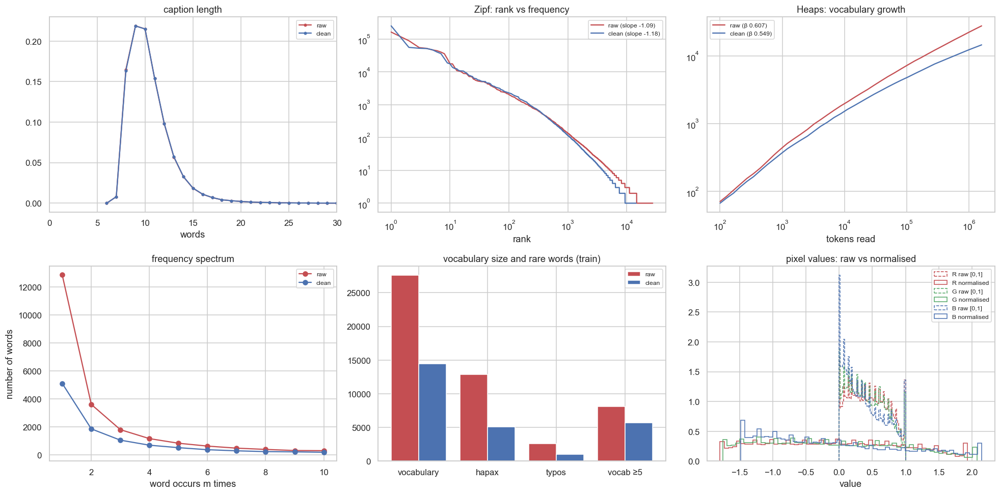
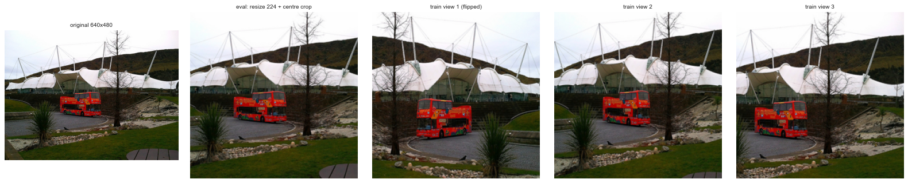

# Before vs After Preprocessing: Comparison Report

**Data:** COCO, Karpathy split, **30,496 train / 4,998 val / 5,000 test images** (`prepare_data.py --train-size 30k`, the default).
10 photos that appeared in two splits were removed by `prepare_data.py` (8 from train, 2 from val; test untouched).

**Source:** every number below comes from [`eda.ipynb`](eda.ipynb) (Parts A–D), saved in `summary_raw.json`, `summary_clean.json` and `comparison.csv`.

- **Before** = captions exactly as downloaded, split on spaces, with case and punctuation kept.
- **After** = captions after our 6-step cleaning.
- The original caption files are untouched. Cleaned text is saved separately.

---

## 1. What preprocessing did, step by step

| Step | What it does | Captions changed (of 202,604) |
|---|---|---:|
| 1 | Unicode normalisation (NFKC), trim, collapse double spaces | 2,333 (1.2%) |
| 2 | Lowercase | 172,536 (85.2%) |
| 3 | Remove apostrophes (*chef's → chefs*, the Karpathy/COCO convention) | 2,614 (1.3%) |
| 4 | Punctuation and hyphens → space (*ice-cream → ice cream*) | 154,222 (76.1%) |
| 5 | Conservative spelling correction (train-only, logged) | 1,402 (0.7%) |
| 6 | Drop exact duplicate captions of the same image | 105 removed (0.05%) |

**Not done, on purpose:**
- **Stopwords kept.** A caption model must generate "a", "on", "of".
- **Low-quality captions kept, only flagged.**
- **No stemming or lemmatising.** The model must output real inflected words ("sitting", not "sit").

### Spelling correction (step 5)

**How it works:**
- A word is corrected only if all of these hold:
  - it's not an English word
  - it appears ≤ 2 times in train
  - it has ≥ 4 letters
  - one edit away there's an English word seen ≥ 10 times in train
- It's then replaced by that word.

**Result:** 1,245 distinct words corrected, 1,436 occurrences in total (0.07% of 2.1 million words).

- **Typical fixes:** *sititng → sitting, buildng → building, baaeball → baseball, girafffe → giraffe, snadwich → sandwich, gril → girl.*
- **Hand-checked sample of 60** (same rule, on the 10k run): about 80% clearly right, 10% ambiguous, 10% wrong (*xbox → box, karts → carts*).
- **Left alone:** 1,179 suspicious words had no safe fix (brand names, merged words such as *onthe*, *trainstop*).
- **Review:** the full list is in `data/coco/analysis/spelling_corrections.csv`.

---

## 2. Text: side-by-side numbers

| Metric | Before | After | Change |
|---|---:|---:|---:|
| Captions | 202,604 | 202,499 | −105 duplicates |
| Distinct words in train (vocabulary, "types") | **27,588** | **14,469** | **−47.6%** |
| Words written in more than one way | 5,891 | 0 | −100% |
| Hapax legomena (train words seen once) | 12,862 | 5,117 | −60.2% |
| Hapax share of vocabulary | 46.6% | 35.4% | −11.2 pts |
| Dis legomena (seen twice) | 3,616 | 1,870 | −48.3% |
| Type–token ratio | 0.0173 | 0.0091 | −47.6% |
| Root TTR (Guiraud) | 21.84 | 11.45 | −47.6% |
| MTLD (lexical diversity) | 34.3 | 25.1 | −26.9% |
| Lemmas in train | 23,569 | 10,046 | −57.4% |
| Zipf slope | −1.09 | −1.18 | steeper |
| Heaps' law | V = 6.1·N^0.607 | V = 7.8·N^0.549 | slower growth |
| Types that aren't dictionary words as written | 15,717 | 1,309 | −91.7% |
| Likely typo words | 2,593 | 1,016 | −60.8% |
| **Vocabulary at min-frequency 5** | 8,122 | **5,714** | −29.6% |
| Train text covered by that vocabulary | 98.1% | **99.1%** | +1.0 pt |
| **Val words unknown to train vocabulary (min-freq 5)** | 2.21% | **1.14%** | **−49%** |
| Val captions with ≥1 unknown word (min-freq 5) | 17.9% | **10.3%** | −7.6 pts |
| Val words unknown to train vocabulary (all words) | 0.88% | 0.39% | −56% |
| Vocabulary overlap train/val (Jaccard) | 0.31 | 0.40 | +29% |
| Captions with uppercase / punctuation / double spaces | 85.2% / 76.3% / 1.1% | 0 / 0 / 0 | removed |
| Distinct characters used | 89 | 37 | a–z, 0–9, space |
| Mean caption length (words) | 10.45 | 10.46 | unchanged |
| 99th percentile / max length | 19 / 50 | 19 / 49 | unchanged |
| Stopword share | 44.9% | 44.9% | unchanged (kept) |
| Nouns / verbs / adjectives | 36.6 / 11.4 / 8.0% | 35.4 / 11.6 / 8.2% | ~unchanged |

### What the numbers mean

- **The vocabulary nearly halved with no loss of meaning.** The raw text had 27,588 "words", but only 16,161 distinct words once case and punctuation are ignored.
  - "a" appears as `a` (163,351) and `A` (88,913), plus a few forms like `A.`.
  - "man" appears as `man`, `Man`, `man.`, `MAN`, `man,` and `Man,`.
  - A model would learn each form as a separate word, splitting the training signal.
- **Rare words fell by 60%.** Hapax legomena dropped from 12,862 to 5,117. Most raw "rare words" were common words with a capital letter or a full stop attached.
- **Lexical diversity dropped, and that's good.** TTR, root TTR and MTLD fell because the raw "diversity" was fake variety from formatting.
- **Generalisation improved most.** Val words unknown to the train vocabulary halved (2.2% → 1.1%). Captions with an unknown word fell from 18% to 10%. For a captioning model this means far fewer `<unk>` tokens at test time.
- **Heaps β fell from 0.61 to 0.55.** After cleaning, the vocabulary grows more slowly with more data. Going from 30k to the full 113k training images (≈ 3.7× more text) should roughly double the vocabulary (3.7^0.55 ≈ 2), not quadruple it.
- **Types per lemma rose (1.17 → 1.44).** The lemmatiser couldn't recognise `Man.` or `Sitting` in raw text. After cleaning the real inflectional variety (*sit / sits / sitting*) becomes visible.
- **What didn't change:** caption length, stopword share and the part-of-speech mix. Cleaning removed formatting noise without changing the content. Tokens rose slightly (+879), because hyphenated words split in two.

### 30k vs the earlier 10k run (after cleaning)

| | 10k train | 30k train |
|---|---:|---:|
| Vocabulary at min-freq 5 | 3,367 | **5,714** |
| Val words unknown to train vocabulary | 2.37% | **1.14%** |
| Val captions with an unknown word | 20.0% | **10.3%** |

Tripling the training set halves the unknown-word problem. This is the main reason for moving to 30k.

---

## 3. Images: before vs after the pipeline

**Pipeline** (CLIP / BLIP standard):
1. convert to RGB
2. resize the shorter side to 224 (bicubic) and centre-crop 224×224
3. normalise with CLIP mean/std
4. training only: random crops (50–100% of the area) and horizontal flips

| Metric | Before (raw files, 40,494) | After (eval transform, 1,000 sample) |
|---|---|---|
| Distinct image sizes | 1,534 | 1 (224×224×3) |
| Grayscale images | 66 | 0 (all 3-channel) |
| Channel mean (R, G, B) | 0.468, 0.445, 0.406 | −0.046, −0.056, −0.017 |
| Channel std (R, G, B) | 0.269, 0.265, 0.279 | 1.014, 1.015, 1.017 |

After normalisation every channel has **mean ≈ 0 and std ≈ 1**, which is what pretrained encoders expect.

**Horizontal flip rule:** 0.29% of captions mention "left" or "right", often not as directions (*"right next to"*, *"right now"*). Swapping the words would corrupt those captions. Instead, flipping is **disabled for the 560 images (1.4%)** whose captions mention left/right.

**Originals are kept:** different models need different sizes (CLIP 224, BLIP 384), so images are transformed on loading.

---

## 4. Data fixes outside the text/image pipeline

| Issue | Status |
|---|---|
| **10 photos appeared in two splits** (COCO uploaded them twice under different IDs) | **Fixed in `prepare_data.py`**: dropped 8 train copies and 2 val copies; test untouched. Listed in `data/coco/removed_duplicates.json`. The notebook's independent re-check finds **0** cross-split duplicates. |
| 4 duplicate photo pairs inside train | Kept (no leakage). Listed in `analysis/duplicate_images.csv`. |
| 1,016 remaining likely-typo words | Mostly brand names and merged words. Handled by `<unk>` (min-frequency 5). |
| Wrong captions (e.g. "zebras" on a giraffe photo) | Not detectable from text alone. Needs an image–text check. |
| 94 images now have fewer than 5 captions (92 with 4, 2 with 3) | Only because their exact duplicate captions were removed. |

---

## 5. Output files (in `data/coco/`, not on GitHub)

| File | Contents |
|---|---|
| `{train,val,test}/captions_clean.json` | cleaned caption strings + tokens per image, same image order as `captions.json` |
| `vocab.json` | 5,718 tokens (5,714 words + `<pad> <start> <end> <unk>`), max length 19 (truncates 0.8% of captions) |
| `preprocess_config.json` | every text and image setting, normalisation constants, no-flip image list |
| `removed_duplicates.json` | the 10 cross-split duplicates removed by `prepare_data.py` |
| `analysis/spelling_corrections.csv` | all 1,245 corrections |
| `analysis/duplicate_images.csv` | the 4 remaining within-train duplicate pairs |
| `analysis/caption_flags.csv` | quality score and flags per caption |
| `analysis/image_info.csv` | size, mode, brightness, contrast, sharpness per image |

**Note on evaluation:** captioning scores (BLEU, CIDEr, …) are computed against the **original** captions with the standard COCO evaluation code, which applies its own tokenisation. The cleaned text is for training and for retrieval queries.
