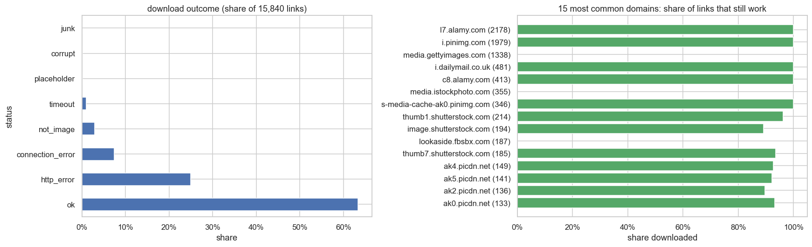
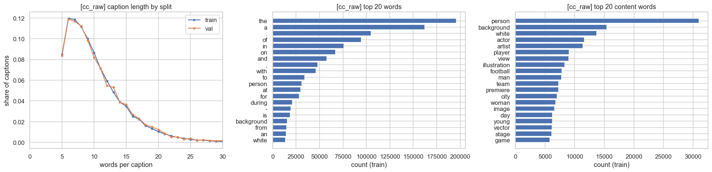
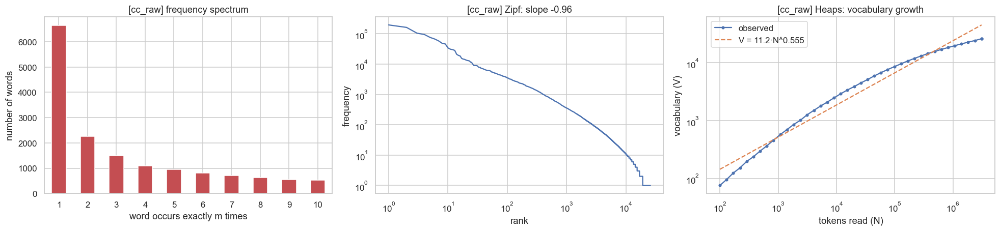
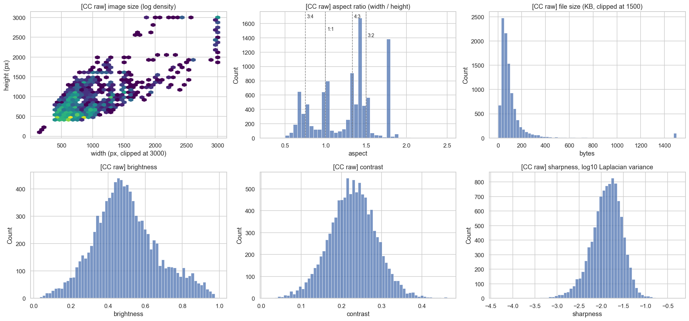
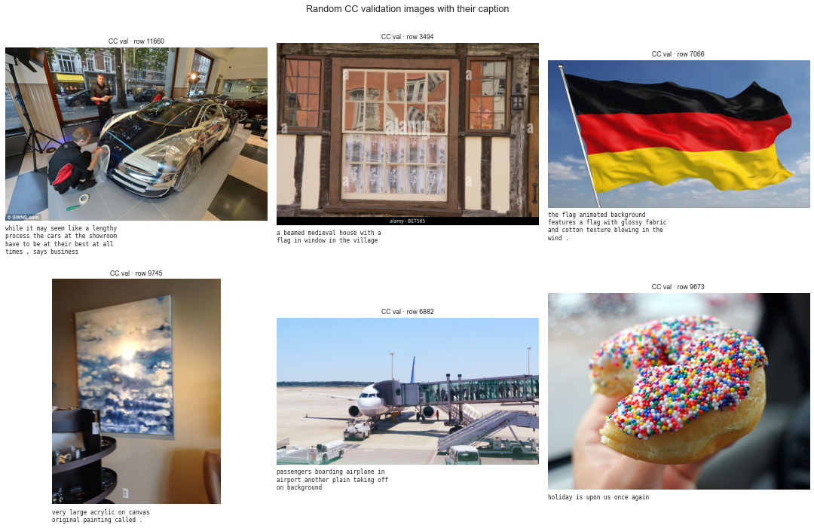
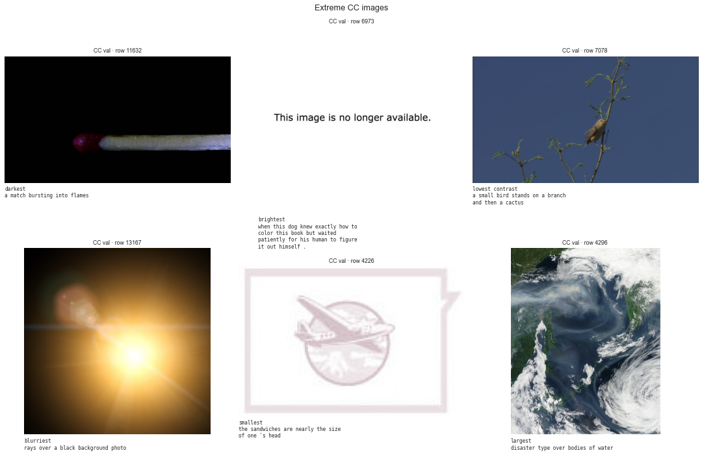
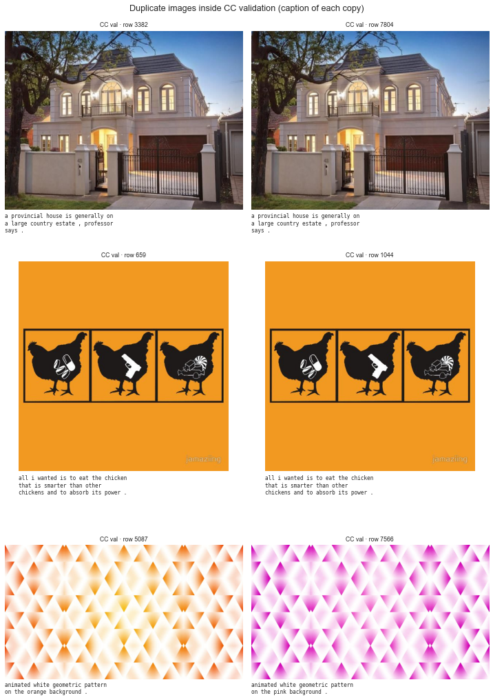
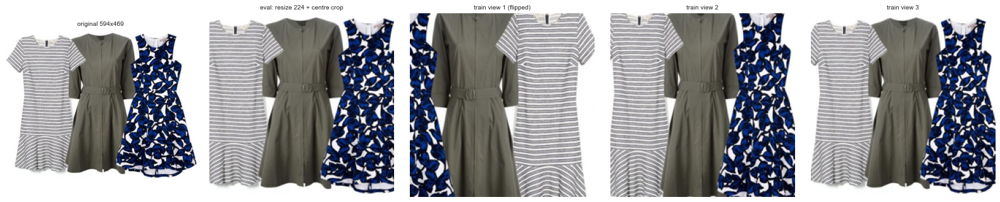
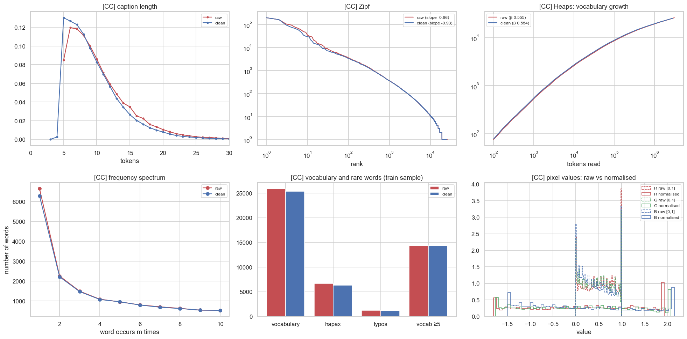
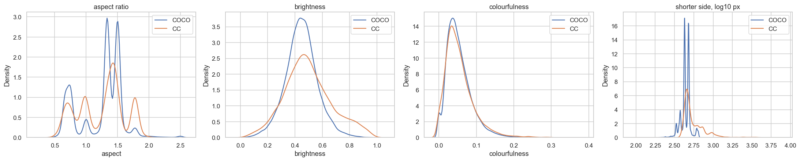

# Conceptual Captions (CC3M): Data Report

**Data:** downloaded by `prepare_cc.py`:
- CC **validation** set: all 15,840 captions, and the **10,038 images** that could still be downloaded
- CC **train** captions as text only: all 3,318,333 for the vocabulary, plus a fixed random sample of 300,000 (seed 42) for statistics

**Code:** every number and figure comes from [`cc_eda.ipynb`](cc_eda.ipynb) (summaries in `cc_summary_raw.json`, `cc_summary_clean.json`, `cc_comparison.csv`, `coco_vs_cc.csv`). It uses the same analysis functions as the COCO notebook ([`eda_utils.py`](eda_utils.py)), so numbers are directly comparable with [`report.md`](report.md).

---

## Key findings

1. **The dataset is mostly as described in the paper.** Our 3,318,333 train captions have 51,200 unique tokens (paper: 51,201), mean length 10.31 (paper: 10.3) and median 9 (paper: 9).
2. **37% of validation image links are dead.** We got 10,038 of 15,840 images (63.4%). Failures are domain-wide: Getty Images and iStock now refuse every request, while Alamy and Pinterest still serve 100%.
3. **CC captions are web text, not descriptions.**
   - Names are replaced by generic words ("person" in 10% of captions, "actor" 3%, "artist" 3%).
   - 13% of captions have no a/an/the (COCO: 4.5%).
   - There's stock-photo language ("isolated on a white background", "vector illustration").
   - Some machine-generated alt-text slipped in ("image may contain: person…", ~1% of captions).
4. **CC is far more varied than COCO.**
   - **Lexical diversity:** MTLD 154 vs 25 for COCO.
   - **Vocabulary:** 26,990 words vs 5,718.
   - **Zipf curve:** flatter (−0.93 vs −1.18).
5. **The domain gap is large and one-sided.**
   - **COCO → CC:** **64% of CC validation captions contain a word COCO's vocabulary doesn't know.**
   - **CC → COCO:** only 7% of COCO captions contain a word CC's vocabulary doesn't know.
   - A COCO-trained model will struggle on CC, as the CC paper also reports (COCO-trained models score CIDEr ≈ 0.18 on CC).
6. **Images differ too.** CC images are brighter, more often square (14% vs 5%), more varied in size (3,340 distinct sizes vs 1,534), and often carry stock-photo watermarks.
7. **There's no image overlap between COCO and CC.** We found 0 duplicates across the two datasets (495 candidates checked), so using both is leak-free.
8. **Preprocessing changes little,** because CC is distributed already lowercased and tokenised. The main step removes punctuation tokens: −7% tokens, −5% vocabulary.

---

## About the dataset

| | |
|---|---|
| Source | Sharma et al., *Conceptual Captions*, ACL 2018 ([paper](https://aclanthology.org/P18-1238.pdf), [GitHub](https://github.com/google-research-datasets/conceptual-captions)) |
| Splits | train 3,318,333 · validation 15,840 · test ~12.5K **hidden** (official leaderboard only) |
| Captions per image | 1 |
| Distribution | caption + image **URL** only. Google's original download links now return 403, but the [Hugging Face mirror](https://huggingface.co/datasets/google-research-datasets/conceptual_captions) works. |

**How it was built** (paper, Section 3), from ~5 billion web images:
1. **Image filter:** JPEG only, both sides > 400 px, aspect ratio ≤ 2, no offensive content.
2. **Text filter:** the alt-text needs a noun, a determiner and a preposition, sensible capitalisation, and no rare tokens or boilerplate.
3. **Image–text match:** at least one word must match an image label from Google's classifier.
4. **Hypernymisation:** names, dates and locations are replaced or removed (*Harrison Ford → actor*).

Only **0.2%** of candidates survived. Human raters judged 90.3% of the captions good.

**Benchmarks:**

| Result | Score |
|---|---|
| CC-trained Transformer on the CC test set (paper) | CIDEr 1.676 |
| COCO-trained models on CC | CIDEr ≈ 0.18–0.19 |
| ClipCap on CC validation | CIDEr 87.3 (MLP + GPT-2 tuning), 71.8 (Transformer) |
| VLP on CC validation | CIDEr 77.6 |

CC3M is also part of the standard "4M" pre-training set used by UNITER, ALBEF and BLIP.

---

## Part A: Raw data

### A1. Download outcome

| Status | Images | Share |
|---|---:|---:|
| **Downloaded** | **10,038** | **63.4%** |
| HTTP error (400: 1,744 · 404: 1,335 · 403: 548 · others) | 3,955 | 25.0% |
| Server unreachable | 1,179 | 7.4% |
| Returned a web page, not an image | 457 | 2.9% |
| Timeout | 165 | 1.0% |
| Placeholder (same "not available" file for ≥ 3 URLs) | 24 | 0.2% |
| Corrupt file | 19 | 0.1% |
| Junk (blank image, rendered error message, 1×1 pixel) | 3 | 0.02% |

**Where failures come from:**
- **Whole domains fail together:**

| Domain | Links | Downloaded |
|---|---:|---:|
| media.gettyimages.com | 1,338 | 0% |
| media.istockphoto.com | 355 | 0% |
| lookaside.fbsbx.com (Facebook) | 187 | 0% |
| l7.alamy.com | 2,178 | 100% |
| i.pinimg.com (Pinterest) | 1,979 | 100% |

- The 15,840 links span **3,377 domains**, and the top 10 hold 48.5% of them.

**Is the downloaded set biased?** Only slightly. Captions of downloaded images average 10.66 words vs 9.96 for dead links (KS D = 0.063). But because whole stock-photo sites are missing, the surviving images over-represent Alamy, Pinterest and news photos.

**Integrity:**
- every image file ↔ exactly one caption entry (checked by `prepare_cc.py`)
- 0 duplicate URLs and 0 empty captions
- 290 caption texts appear twice (generic sentences)

**Teammates:** links keep dying, so a teammate's download may differ slightly. `download_log.csv` records exactly what was fetched.

### A2. Text (raw, as distributed)

**Check against the paper (all 3.3M train captions):**

| | Paper (Table 3) | Measured |
|---|---:|---:|
| Train captions | 3,318,333 | 3,318,333 |
| Unique tokens | 51,201 | 51,200 |
| Mean tokens per caption | 10.3 | 10.31 |
| Std / median | 4.5 / 9 | 4.67 / 9 |

**Statistics** (300k train sample + 15,840 validation; same functions as COCO):

| Group | Statistic | Raw |
|---|---|---:|
| Size | tokens / distinct words (train sample) | 3,255,424 / 25,818 |
| Richness | type–token ratio / root TTR / MTLD | 0.0084 / 14.69 / 131.3 |
| Rare words | hapax legomena (sample) | 6,646 (25.7% of types) |
| | hapax legomena (all 3.3M) | 32.3% of 51,200 types |
| | dis legomena | 2,257 |
| Laws | Zipf slope | −0.96 |
| | Heaps' law | V = 11.2 · N^0.555 |
| Length | tokens per caption | mean 10.31, median 9, p95 19, p99 26, max 49 |
| | characters per word | 4.41 |
| Grammar | POS mix | 37% nouns, 15% prepositions, 13% determiners, 10% verbs, 9% adjectives |
| | lemmas | 17,831 |
| Spelling | likely typos | 1,199 (4.6% of the vocabulary; COCO raw: 9.4%) |
| Generalisation | vocabulary at min-freq 5 | 14,328 (covers 99.4% of train text) |
| | val words unknown to it | 0.91% (8.4% of val captions) |

**Character level (validation captions):**

| Feature | Share |
|---|---:|
| Contains uppercase | 0% (already lowercased) |
| Contains punctuation | 51.9% |
| Ends with "." | 32.9% |
| Contains a digit | 2.6% |
| Contains non-ASCII characters | 0.2% |

The most common punctuation tokens are `.` (5,203), `,` (2,592), `-` (1,029), `:` (793), `!` (546) and `'s` (523).

**What makes CC captions different:**

| Word (share of captions) | CC validation | COCO train |
|---|---:|---:|
| person | 10.4% | 4.1% |
| actor | 2.9% | 0% |
| artist | 2.8% | 0% |
| city | 2.3% | 1.8% |
| people | 1.8% | 7.0% |
| team | 1.4% | 0.1% |
| film | 1.3% | 0.01% |

- **Missing determiners:** captions without a/an/the make up 12.8% in CC vs 4.5% in COCO (*"actor attends the premiere at festival"*).
- **Common trigrams** reveal the sources:
  - stock photos: *"a white background"* (4,434 in the 300k sample), *"vector illustration of"*
  - event photos: *"actor attends the"*
  - machine-generated Facebook alt-text: *"image may contain : person"* (3,132, ~1%)
- **Directional words:** "left/right" appear in 1.0% of captions (COCO: 0.3%).

### A3. Images (10,038 downloaded)

| Property | Finding |
|---|---|
| Format | 10,006 JPEG, 28 WebP, 4 MPO |
| Colour mode | 9,971 RGB, 64 grayscale, 3 CMYK |
| Size | 3,340 distinct sizes; median 640 × 494; 98.3% have both sides > 400 px; 100% have aspect ratio ≤ 2 (the paper's filter still holds) |
| Shape | 64% landscape, 22% portrait, 14% square |
| File size | median 73 KB |
| Pixel mean / std (R, G, B) | 0.524, 0.499, 0.469 / 0.309, 0.302, 0.315 (brighter and higher-contrast than COCO) |
| Exposure | 175 very dark, 375 very bright (many white-background product shots), 87 low contrast |

**Image quality notes:**
- **Watermarks:** stock photos often carry visible watermarks (e.g. Shutterstock).
- **Captions that don't describe the image:** some captions are web sentences rather than descriptions, e.g. *"slaying a dragon was not a feat to take lightly"* for a photo of a leather book.
- **One unusable image remains** (row 6973, an image saying *"This image is no longer available."*). It's served only once, so the placeholder rule (same file for ≥ 3 URLs) can't catch it.

**Duplicates:**
- **Inside CC validation: 3 pairs found.** 2 are true copies with identical captions. The third is the same pattern in two colours with two different captions, so it isn't a real duplicate (the grayscale check can't see colour).
- **COCO ↔ CC:** 495 candidate pairs checked, **0 duplicates**.

---

## Part B: Preprocessing (CC's own pipeline)

Applied to 315,840 captions (300k train sample + 15,840 validation):

| Step | What | Captions changed |
|---|---|---:|
| 1 | Unicode NFKC, collapse whitespace | 0 |
| 2 | Lowercase (verifies CC is lowercased) | 4 |
| 3 | Join possessives (`child 's` → `childs`), drop other apostrophes | 11,246 (3.6%) |
| 4 | Remove punctuation tokens; hyphens → space | 161,772 (51.2%) |
| 5 | **No spelling correction**: CC's own pipeline already rejected rare tokens (only 4.6% likely typos vs 9.4% in COCO) | 0 |
| 6 | Drop captions that became empty | 0 |

**Vocabulary** (the CC paper's setting): built from **all 3,318,333 train captions**, cleaned the same way.
- 48,482 distinct words; words with count ≥ 4 → **26,990 tokens** including `<pad> <start> <end> <unk>`.
- Covers **99.9%** of train text.

**Max length:**
- The paper's **15 tokens** truncates **9.2%** of train captions.
- The measured 99th percentile is **24**.
- **Recommendation:** use 24 if full captions matter (generation), 15 to match the paper.

**Images:** the same pipeline as COCO:
1. RGB
2. resize the shorter side to 224 (bicubic) → centre-crop 224
3. normalise (CLIP constants)
4. training only: random crops, and flips except for the 162 images whose captions mention left/right

Originals are kept.

**Outputs** (`data/cc/`, not on GitHub):

| File | Contents |
|---|---|
| `val/captions_clean.json` | 1:1 with downloaded images |
| `val/all_captions_clean.json` | all 15,840 validation captions, cleaned |
| `vocab.json` | the vocabulary |
| `preprocess_config.json` | text and image settings |
| `analysis/` | image info, duplicates, duplicates with COCO |

## Part C: Clean data

| Statistic | Raw | Clean |
|---|---:|---:|
| Tokens | 3,255,424 | 3,027,430 (−7.0%) |
| Distinct words, train sample | 25,818 | 25,365 (−1.8%) |
| Distinct words, all train | 51,200 | 48,482 (−5.3%) |
| Hapax share (sample) | 25.7% | 24.8% |
| MTLD | 131.3 | 153.9 |
| Zipf slope | −0.96 | −0.93 |
| Heaps β | 0.555 | 0.554 |
| Mean / p99 length | 10.31 / 26 | 9.59 / 24 |
| Stopword share | 36.6% | 39.0% |
| Nouns / verbs / adjectives | 36.8 / 10.4 / 9.1% | 39.5 / 11.4 / 9.7% |
| Val words unknown to train vocabulary (min-freq 5) | 0.91% | 0.96% |
| Captions with punctuation | 51.9% | 0% |

Most changes come from removing punctuation tokens (they counted as words before), which is why the stopword and POS shares rise slightly. **Images after the pipeline:** all 224×224×3. The channel mean (0.16, 0.16, 0.23) and std (≈ 1.14) are slightly off from 0 and 1, because CC images are brighter and higher-contrast than the data CLIP's constants came from.

Full table: `cc_comparison.csv`.

---

## Part E: COCO vs Conceptual Captions

| Metric (after cleaning) | COCO | CC |
|---|---:|---:|
| Captions per image | 5 | 1 |
| Mean caption length (words) | 10.5 | 9.6 |
| Median / 99th percentile length | 10 / 19 | 9 / 24 |
| Mean word length (characters) | 4.0 | 4.7 |
| Stopword share | 44.9% | 39.0% |
| Captions without a/an/the | 4.5% | 12.8% |
| **MTLD (lexical diversity)** | **25.1** | **153.9** |
| Zipf slope | −1.18 | −0.93 |
| Heaps β | 0.549 | 0.554 |
| Nouns / verbs / adjectives | 35.4 / 11.6 / 8.2% | 39.5 / 11.4 / 9.7% |
| Training vocabulary (own pipeline) | 5,718 | 26,990 |
| Own val captions with an unknown word | 10.3% | 1.3% |
| **Val captions with a word unknown to the *other* dataset's vocabulary** | **6.9%** | **64.3%** |
| Val words unknown to the *other* vocabulary | 0.7% | 12.7% |

**What this means:**
- **COCO captions are simple and repetitive.** Five people describe the same scene with a small set of words, so MTLD is low and the curve is steep.
- **CC captions are varied web language:** people, events, stock imagery and abstract concepts.
- **CC's vocabulary covers COCO** (only 0.7% of COCO words are unknown to it). **COCO's vocabulary doesn't cover CC:** 12.7% of CC words and 64% of CC captions contain an unknown word. That's the **domain gap**: a captioner trained only on COCO will output `<unk>` or wrong words on web images.
- CC's low "own" OOV (1.3%) partly reflects its much larger training text (3.3M captions vs 30k COCO images).

**Most typical words** (log ratio of relative frequencies):

| Typical of COCO | Typical of CC |
|---|---|
| wii, racquet, nintendo, hotdog, urinals, controllers, hydrant, frisbee, selfie, remotes | actor, premiere, vector, attends, artist, isolated, illustration, icon, director, comedian, footballer |

**Images:**

| | COCO | CC |
|---|---:|---:|
| Images | 40,494 | 10,038 |
| Distinct sizes | 1,534 | 3,340 |
| Median size | 640 × 480 | 640 × 494 |
| Grayscale | 0.16% | 0.64% |
| Landscape | 71.7% | 63.9% |
| Mean brightness | 0.448 | 0.496 |
| Mean colourfulness | 0.053 | 0.055 |

**Differences:**
- **COCO** is everyday photos of common objects in natural scenes.
- **CC** adds product shots on white backgrounds, illustrations, graphics, event and celebrity photos, and watermarked stock images.

---

## Recommendations

1. **Use CC validation as the out-of-domain test set,** not as training data. It's the standard use, and it directly measures how well a COCO-trained model generalises. Report results on the 10,038 downloaded images, and note the dead-link rate.
2. **Expect a large drop** for COCO-only models on CC, consistent with the paper (CIDEr ~0.18 vs ~1.0+ in-domain). Pretrained encoders (CLIP, BLIP), trained on web data much like CC, should close much of this gap. That's a useful comparison for the project.
3. **For retrieval on CC,** use CLIP's own BPE tokeniser rather than a word vocabulary. The 64% unknown-word rate makes word-vocabulary models a poor fit.
4. **If CC is ever used for training:** download a train subset the same way (expect ~60% of links to work), use the CC vocabulary, and consider max length 24 instead of 15.

## Limitations

- **Our image set is ~63% of CC validation.** Whole stock-photo domains are missing, so the image statistics describe the surviving images, not the original set.
- **One unusable image (row 6973) remains.** Unique placeholders aren't caught automatically.
- **Duplicate detection** uses grayscale thumbnails, so colour variants can be flagged as duplicates (1 of 3 here).
- **Train statistics** use a 300k sample (9% of train); the vocabulary and paper check use all 3.3M captions.
