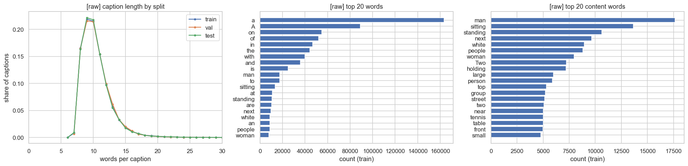
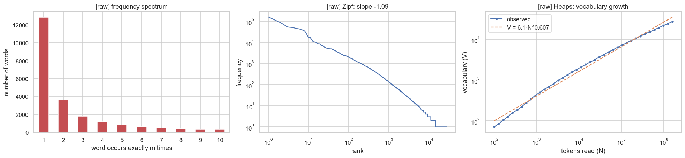
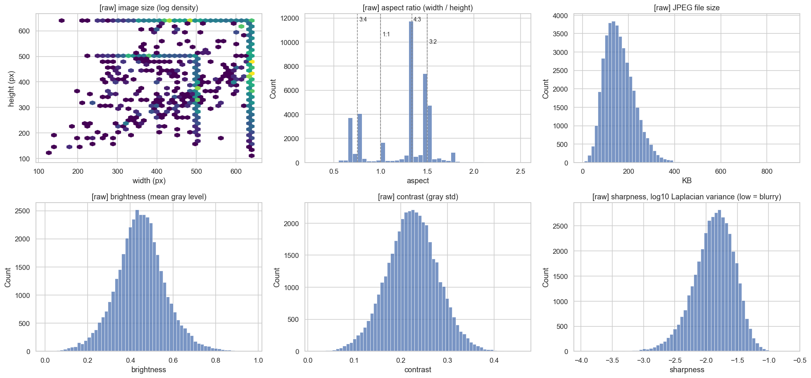
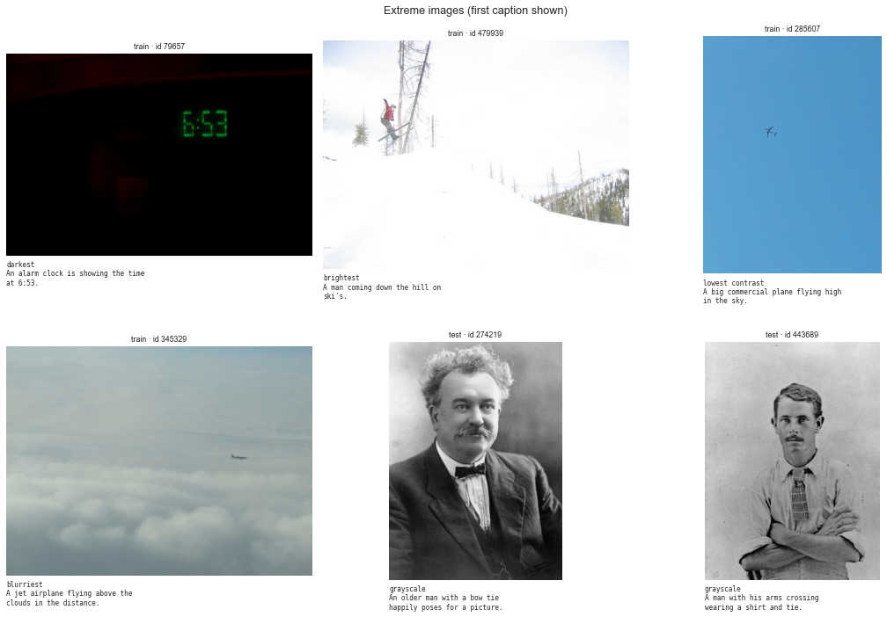
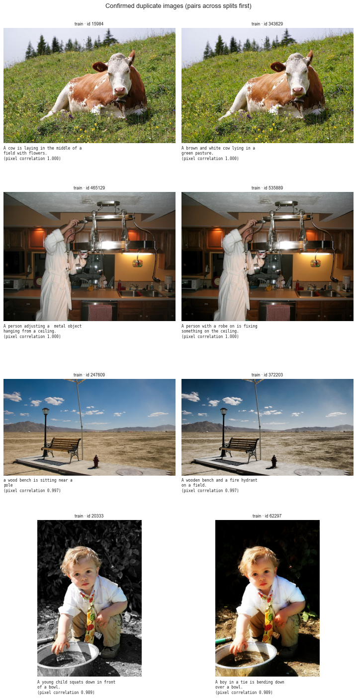
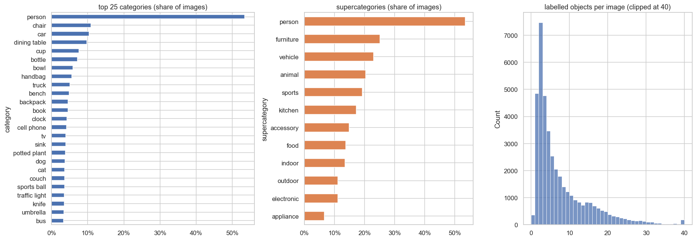
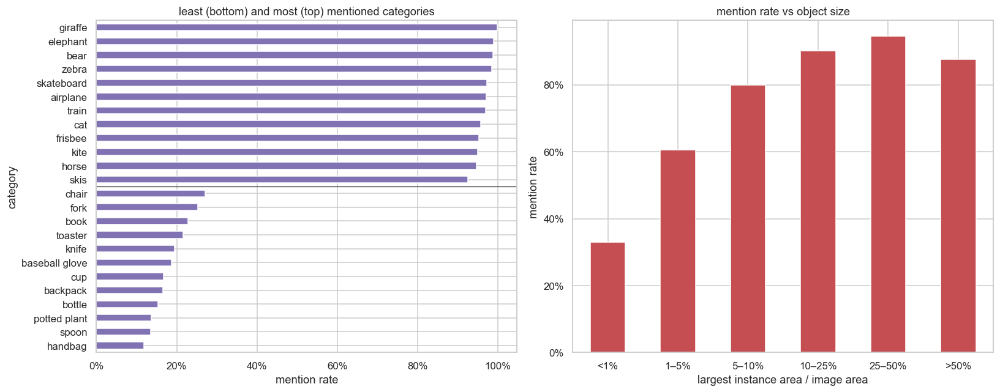
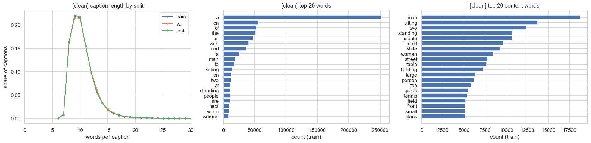
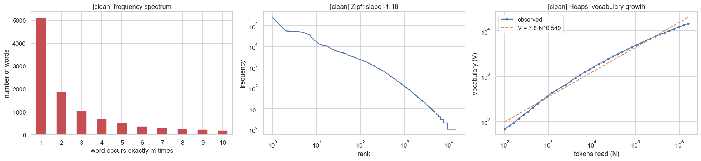

# Week 1 Report: Understanding the COCO Data

**Data:** COCO, Karpathy split, **30,496 train / 4,998 val / 5,000 test images** (202,604 captions), built by `prepare_data.py` (default `--train-size 30k`).
**Code:** every number and figure comes from [`eda.ipynb`](eda.ipynb) and is regenerated by re-running it.
**Before/after cleaning comparison:** see [`before_vs_after.md`](before_vs_after.md).

The notebook works in four parts:

| Part | Content |
|---|---|
| **A** | Analyse the raw data |
| **B** | Preprocess it |
| **C** | Re-run the same analysis on the clean data |
| **D** | Compare before and after |

---

## Key findings

1. **The split is clean.** There's zero ID overlap and zero shared photos between splits. Every image has exactly its own captions and object labels, every caption matches the official COCO file, and every image decodes.
   - **The fix:** COCO contains 10 photos uploaded twice under different IDs that the Karpathy split puts in two splits. `prepare_data.py` removes the extra copy: 8 from train, 2 from val, test untouched.
2. **The train set is representative.** Caption-length distributions are identical across splits, and object-category frequencies correlate ≥ 0.96 between splits.
3. **Raw text is very noisy in form, but not in content.** 27,588 raw word forms collapse to 16,161 real words. 85% of captions have capitals and 76% have punctuation. Cleaning cuts the vocabulary by 48% and unknown val words by half.
4. **Captions are short, templated and object-centric.** They average 10.5 words, 45% are stopwords, 37% are nouns and only 11% verbs.
5. **Vocabulary is long-tailed.** It follows Zipf's law (slope −1.09 raw, −1.18 clean). 47% of raw words appear only once (35% after cleaning).
6. **Images are uniform.** Most are 640 px on the long side, 72% landscape, 66 grayscale, none corrupt. Their colour statistics are close to the ImageNet/CLIP constants.
7. **Captions describe the prominent objects only.** Objects covering > 10% of the image are mentioned ~90–95% of the time, small ones (< 1%) only 33%.
8. **30k train is clearly better than 10k.** After cleaning, val captions with an unknown word drop from 20% (10k) to 10% (30k).

---

## Part A: Raw data (as downloaded)

### A1. Integrity

| Check | Result |
|---|---|
| Images (train / val / test) | 30,496 / 4,998 / 5,000 |
| Captions | 202,604 (5 per image; 128 images have 6, 3 have 7) |
| ID overlap between splits | 0 |
| Same photo in two splits | 0 (10 removed by `prepare_data.py`, see A3) |
| Image files ↔ caption entries ↔ object entries | match exactly in every split |
| Captions vs official COCO file | identical for all 40,494 images |
| Empty captions | 0 |
| Duplicate captions within one image | 56 exact, 104 ignoring case/punctuation |
| Same caption text on different images | 2,548 (generic sentences such as *"a man riding a wave on top of a surfboard"*) |

### A2. Text statistics (raw, split on spaces)

| Group | Statistic | Raw value |
|---|---|---:|
| Size | captions / tokens | 202,604 / 2,117,744 |
| | distinct words in train ("types") | 27,588 |
| Richness | type–token ratio | 0.0173 |
| | root TTR (Guiraud) | 21.84 |
| | MTLD | 34.3 |
| Rare words | hapax legomena (seen once) | 12,862 (46.6% of types, 0.8% of tokens) |
| | dis legomena (seen twice) | 3,616 (13.1% of types) |
| | hapax : dis ratio | 3.56 |
| Laws | Zipf slope | −1.09 |
| | Heaps' law | V = 6.1 · N^0.607 |
| Length | words per caption | mean 10.45, median 10, p95 15, p99 19, min 6, max 50 |
| | characters per caption | mean 52.3 |
| | characters per word | mean 4.10 |
| Grammar | lemmas in train | 23,569 (1.17 types per lemma) |
| | POS mix | 37% nouns, 21% determiners, 16% prepositions, 11% verbs, 8% adjectives |
| Spelling | types not dictionary words as written | 15,717 (57%) |
| | likely typos | 2,593 |
| Generalisation | vocabulary at min-freq 5 | 8,122 (covers 98.1% of train text) |
| | val words unknown to train vocabulary (min-freq 5) | 2.2% (17.9% of val captions contain one) |
| | vocabulary overlap train/val (Jaccard) | 0.31 |

**What the raw statistics show:**
- **Form variants inflate everything.** 5,891 words are written in more than one way:

| Word | Raw variants (count) |
|---|---|
| a | `a` (163,351), `A` (88,913), plus `"A`, `A.` |
| the | `the`, `The` (6,716), `THE` (516), `"The` |
| man | `man` (17,646), `Man` (779), `man.`, `MAN`, `man,` |

  So 57% of raw "words" aren't dictionary words as written. The top-20 list contains both `a` and `A`.
- **Character level:**

| Feature | Share of captions |
|---|---:|
| Contains uppercase | 85.2% |
| Ends with "." | 75.1% |
| Contains a fully capitalised word ("A MAN IS…") | 1.2% |
| Contains double spaces | 1.1% |
| Contains a digit | 0.35% |
| Contains non-ASCII characters | 0 |

  25 different punctuation marks appear. The most common are `.` (152,779), `,` (15,102), `'` (2,702), `-` (1,874) and `"` (1,119).
- **Directional words:** 0.29% of captions (560 images) mention left/right. This matters for image flipping (Part B).

### A3. Images (all 40,494, raw)

| Property | Finding |
|---|---|
| Size | 1,534 distinct sizes. 83% are 640 px on the long side. Most common: 640×480 (21%), 640×427 (12%), 480×640 (7%). Smallest side 111 px. |
| Shape | 72% landscape, 24% portrait, 5% square. Aspect ratios cluster at 4:3 and 3:2. |
| Colour mode | 40,428 RGB, **66 grayscale** |
| Corrupt files | 0 (every image fully decoded) |
| Pixel mean / std (R, G, B) | 0.468, 0.445, 0.406 / 0.269, 0.265, 0.279 (close to ImageNet and CLIP constants) |
| Exposure | 320 very dark (mean < 0.15), 75 very bright (> 0.85), 226 low contrast |
| Sharpness | Laplacian-variance distribution is smooth, with no cluster of broken or blank images |

**Duplicate images.**
- **Method, two stages:**
  1. a perceptual hash (dHash) proposes candidate pairs;
  2. each candidate is confirmed on pixels (thumbnail correlation > 0.95, same aspect ratio). Calibrated on hand-checked pairs: true duplicates 0.97–1.00, false matches 0.17–0.69.
- **What the duplicates are:** exact copies, re-crops, colour-edited copies, and consecutive frames of the same shot. I hand-checked the lowest-scoring ones. They come from COCO itself (the same photo uploaded twice).
- **Across splits (fixed):** in the original Karpathy split, **10 photos were in two splits** (6 train↔val, 2 train↔test, 2 val↔test). `prepare_data.py` now runs the same detection and drops the extra copy:
  - train copy if the photo is also in val/test
  - val copy if it's also in test
  - test is never changed, so it stays the official 5,000 images
- **After the fix:** the notebook's independent re-check finds 370 hash candidates and 4 confirmed duplicates, **all inside train, 0 across splits**. Duplicates within train don't leak and are kept.

### A4. Objects (official COCO labels, 80 categories)

| | |
|---|---|
| Labelled objects | 291,829 (mean 7.2 per image, median 4) |
| Images with no labelled object | 367 (0.9%) |
| Most common | person 53%, chair 11%, car 10%, dining table 10%, cup 8% of images |
| Rarest | hair drier (70 images), toaster (74), parking meter (261), scissors (302) |
| Object sizes | 41% small, 34% medium, 24% large |
| Category mix across splits | Spearman ≥ 0.96 |

**Do captions mention the labelled objects?** Only 62% of (image, category) pairs are mentioned in any caption:

| Object size (share of image) | < 1% | 1–5% | 5–10% | 10–25% | 25–50% | > 50% |
|---|---|---|---|---|---|---|
| Mentioned | 33% | 61% | 80% | 90% | 95% | 88% |

- **Most mentioned:** giraffe 99.8%, elephant 98.9%, bear 98.8%, zebra 98.5%.
- **Least mentioned:** handbag 12%, spoon 14%, potted plant 14%, bottle 15%, backpack 17%.

So captions describe the main subject, and a model trained on them will too. For retrieval, text queries about small background objects will be hard to match.

---

## Part B: Preprocessing

The design is based on the standard COCO captioning pipelines: the Karpathy split tokens, ruotianluo/ImageCaptioning.pytorch, the Show-Attend-Tell tutorial, and the CLIP and BLIP code.

**Text pipeline:**
1. Unicode NFKC normalisation, trim, collapse whitespace
2. lowercase
3. remove apostrophes
4. punctuation and hyphens → space
5. conservative spelling correction (1,245 words, about 80% accurate on a hand-checked sample)
6. drop 105 exact duplicates

Then:
- **Keep** stopwords and all other captions; quality is only flagged.
- **Vocabulary:** train only, words seen ≥ 5 times → 5,718 tokens including `<pad> <start> <end> <unk>`.
- **Max length:** 19 words, truncating 0.8% of captions.

**Image pipeline:**
1. convert to RGB
2. resize the shorter side to 224 (bicubic) → centre-crop 224
3. normalise with CLIP (or ImageNet) mean/std
4. training only: random resized crop (50–100% of the area) and horizontal flip, except for the 560 images whose captions mention left/right

The original images are kept.

Full step-by-step counts are in [`before_vs_after.md`](before_vs_after.md).

## Part C: Clean data (same statistics)

| Statistic | Clean value |
|---|---:|
| Distinct words in train | 14,469 |
| Hapax legomena | 5,117 (35.4%) |
| Dis legomena | 1,870 |
| TTR / root TTR / MTLD | 0.0091 / 11.45 / 25.1 |
| Heaps' law | V = 7.8 · N^0.549 |
| Zipf slope | −1.18 |
| Lemmas | 10,046 |
| Likely typos | 1,016 |
| Vocabulary at min-freq 5 | 5,714 (covers 99.1% of train text) |
| Val words unknown to train vocabulary | 1.1% (10.3% of val captions contain one) |
| Train/val overlap (Jaccard) | 0.40 |
| Length | unchanged |
| Stopword share | unchanged |
| POS mix | unchanged |

**Images after the eval transform:** all 224×224×3 RGB (including converted grayscale ones), channel mean ≈ 0 (−0.06 to −0.02), std ≈ 1.02.

## Part D: Before vs after

Cleaning removed formatting noise:
- vocabulary −48%
- rare words −60%
- unknown val words −49%

Content was unchanged: same lengths, stopwords and parts of speech. Full table and discussion: [`before_vs_after.md`](before_vs_after.md).

---

## Recommendations

1. **Use the cleaned captions and vocabulary for training.** Evaluate captioning against the original captions with the standard COCO evaluation code.
2. **Report results on the Karpathy test set** (unchanged, all 5,000 images). Note that 2 val images and 8 train images were removed as cross-split duplicates.
3. **Move to the full 113k train set on the DGX** (`--train-size full`) for final results, and rebuild the vocabulary. Heaps' law predicts the vocabulary roughly doubles, not quadruples. Duplicate removal runs automatically there too.

## Limitations

- The typo detector is dictionary-based. It counts brand names as typos and misses real words used wrongly.
- About 10% of spelling corrections in a 60-word sample were wrong (e.g. *xbox → box*). They affect 0.07% of words.
- The object-mention rate uses a hand-written synonym list, so 62% is a lower bound.
- Duplicate detection finds copies, crops and colour edits. Heavily edited copies (large crops, overlays) could still slip through.
